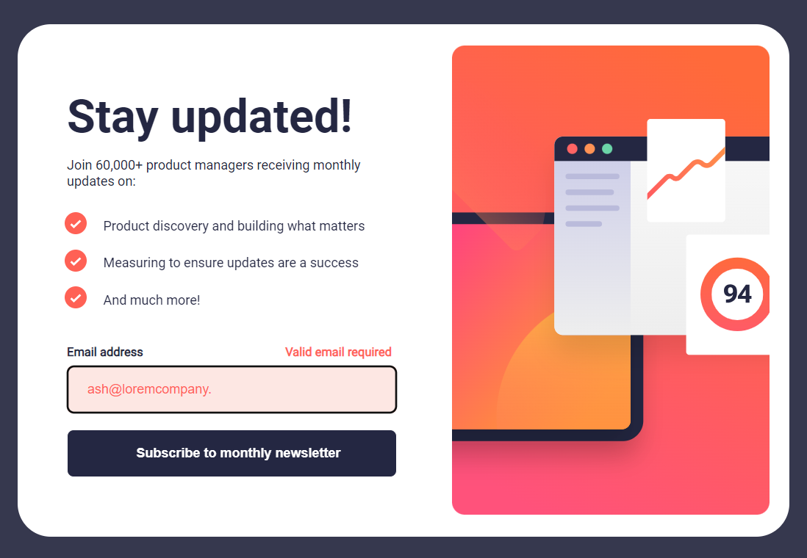
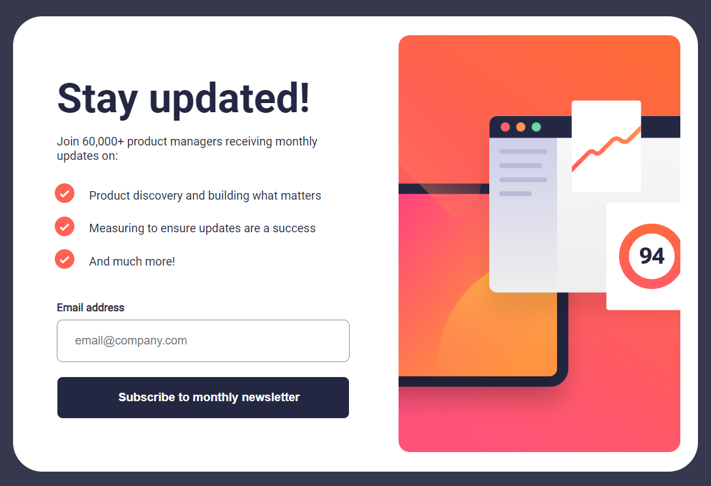
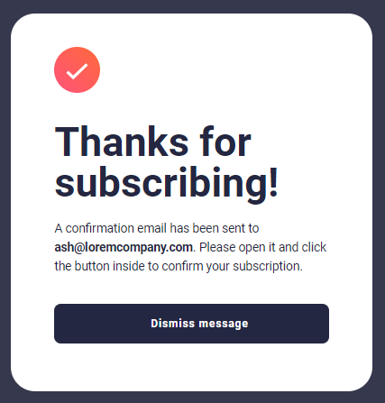
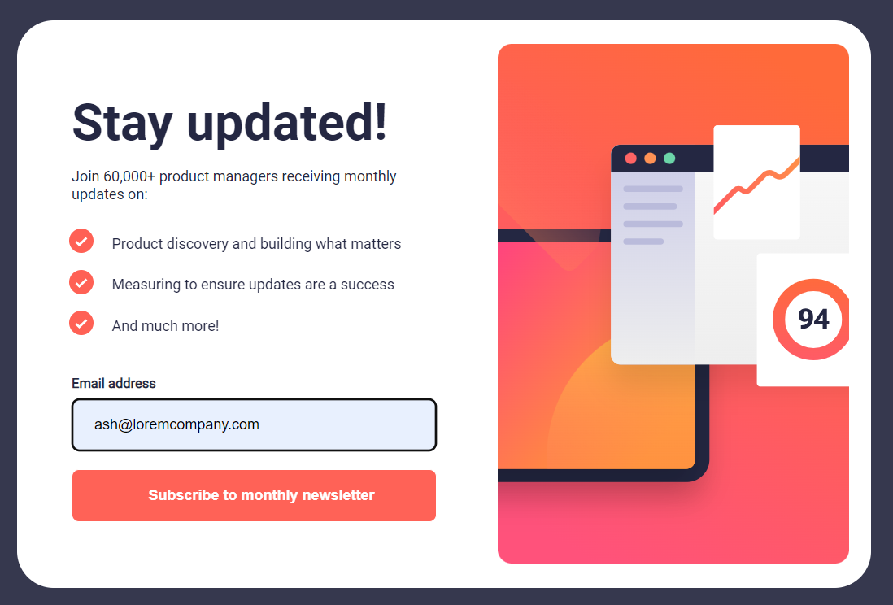
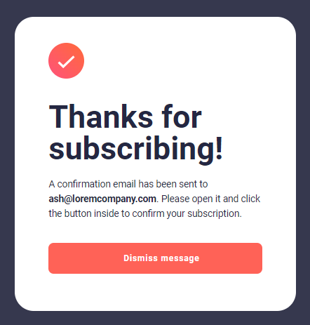
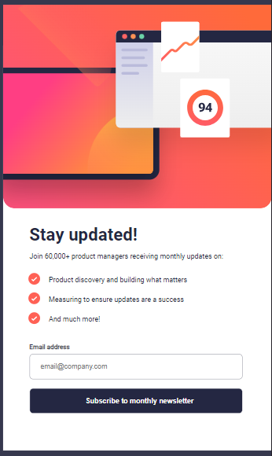
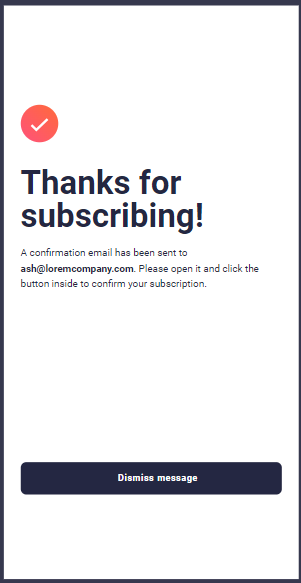

# Newsletter sign-up form with success message

This is a solution to the [Newsletter sign-up form with success message challenge on Frontend Mentor](https://www.frontendmentor.io/challenges/newsletter-signup-form-with-success-message-3FC1AZbNrv).

## Table of contents

- [Overview](#overview)
  - [The challenge](#the-challenge)
  - [Screenshot](#screenshot)
  - [Links](#links)
- [My process](#my-process)
  - [Built with](#built-with)
  - [What I learned](#what-i-learned)
- [Author](#author)

## Overview
This project implements a newsletter sign-up form with a success message using HTML, CSS, and JavaScript. It allows users to subscribe to a monthly newsletter by providing their email address. Upon successful submission, a confirmation message is displayed.

### The challenge

Users should be able to:

- Add their email and submit the form
- See a success message with their email after successfully submitting the form
- See form validation messages if:
  - The field is left empty
  - The email address is not formatted correctly
- View the optimal layout for the interface depending on their device's screen size
- See hover and focus states for all interactive elements on the page

### Screenshot

Error State:

Desktop Preview:

Active State:

Mobile Preview:

### Links

- Live Site URL: [Live site URL here](https://your-live-site-url.com)

## My process
- Designed the layout structure using HTML.
- Styled the components using CSS.
- Implemented form validation and success message functionality using JavaScript.

### Built with

- HTML
- CSS
- Flexbox
- Javascript

### What I learned

Through this project, I gained hands-on experience in:

- Form validation techniques in JavaScript.
- DOM manipulation for showing and hiding elements dynamically.
- Responsive design principles using CSS media queries

## Author

- Frontend Mentor - [@shikha-soni-23](https://www.frontendmentor.io/profile/shikha-soni-23)

